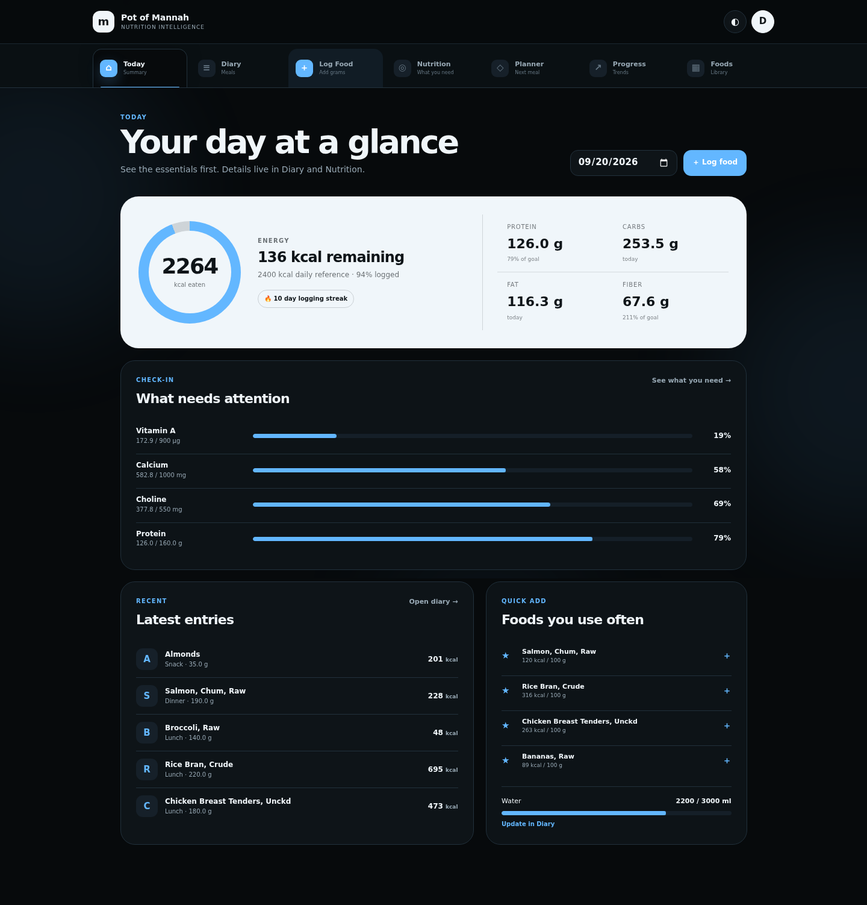
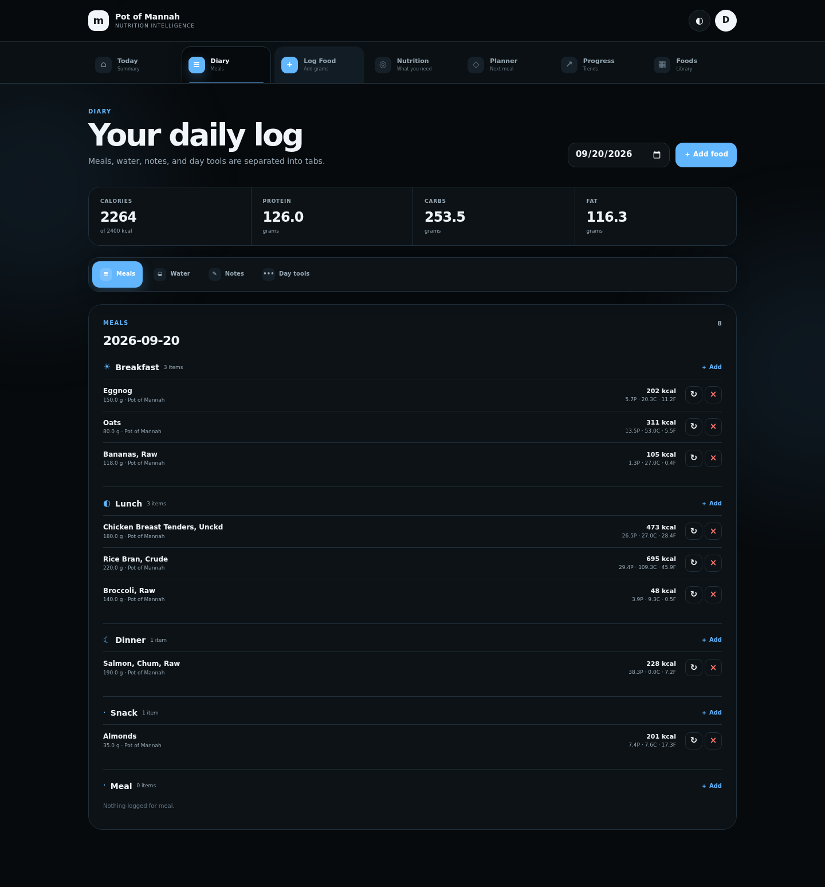
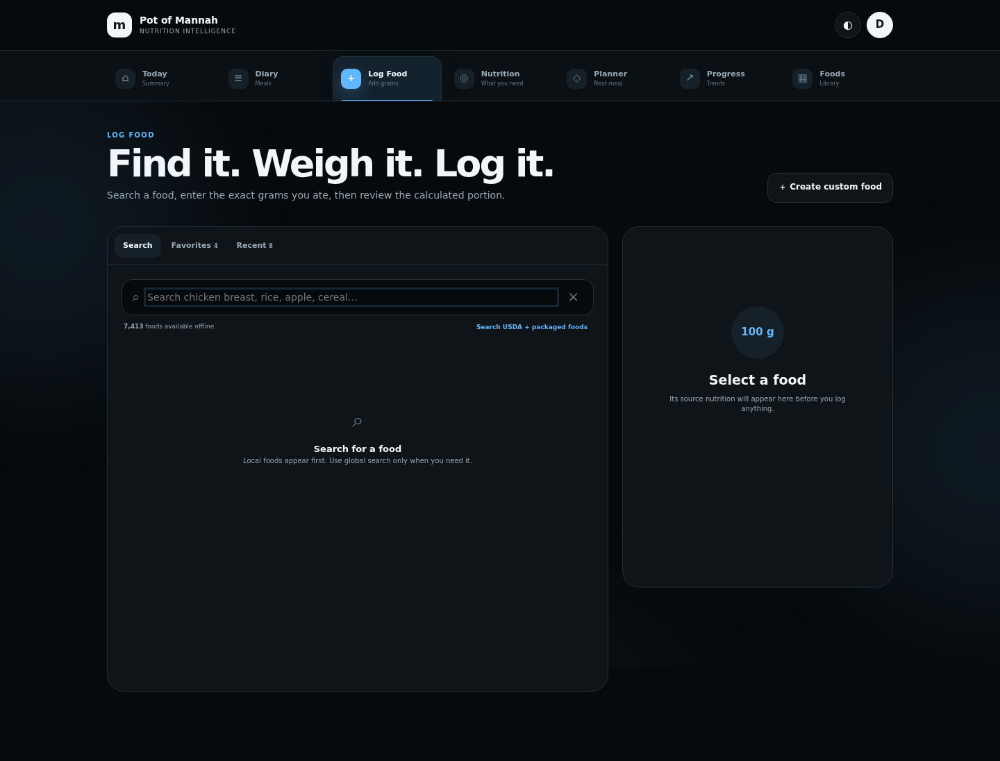
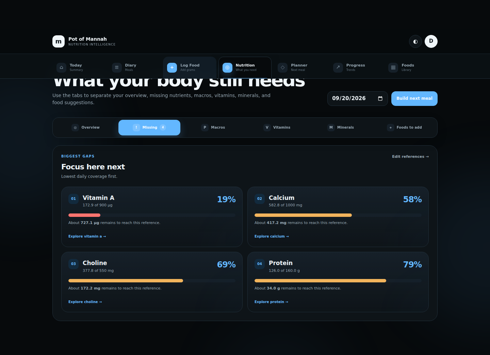
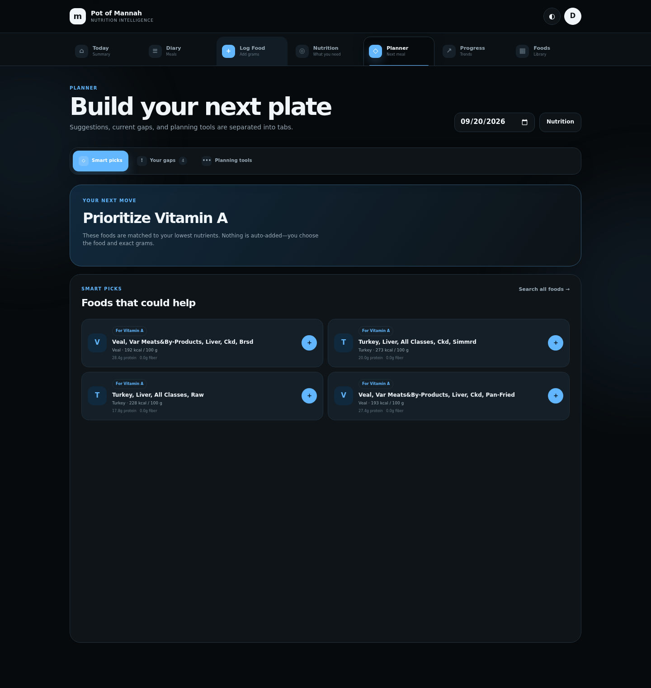
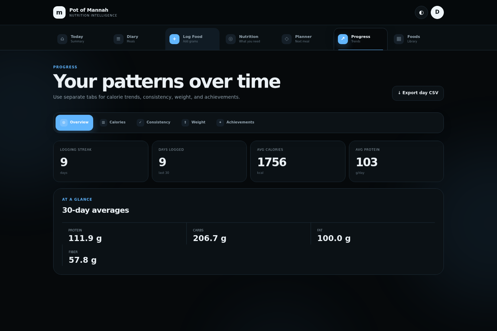

# 🍲 Pot of Mannah v3

> Local-first nutrition intelligence with a dark tabbed web app, a keyboard-first Textual TUI, exact gram logging, 7,000+ foods, nutrient-gap analysis, Playwright media automation, and Docker deployment.

[](https://github.com/iamrichmack111/pot-of-mannah/actions/workflows/ci.yml)
[](https://github.com/iamrichmack111/pot-of-mannah/actions/workflows/playwright-media.yml)
[](https://github.com/iamrichmack111/pot-of-mannah/actions/workflows/container.yml)
[](https://pypi.org/project/pot-of-mannah/)
[](https://www.python.org/)
[](https://github.com/iamrichmack111/pot-of-mannah/pkgs/container/pot-of-mannah)

## What v3 adds

Pot of Mannah started as a terminal nutrition and training application. v3 keeps that TUI and adds a full web experience organized around real application tabs:

**Today · Diary · Log Food · Nutrition · Planner · Progress · Foods**

The web app includes dark themes, animated tab/sub-tab navigation, exact gram logging, per-100 g source transparency, local/global food search, nutrient-gap analysis, meal planning suggestions, hydration, favorites, progress trends, custom foods, and an admin surface.

## Screenshot gallery

The repository's Playwright workflow refreshes these images from a seeded demo account whenever the web UI changes.

| Today | Diary |
|---|---|
|  |  |
| Log Food | Nutrition Needs |
|  |  |
| Planner | Progress |
|  |  |

**Demo:** [Playwright browser demo](media/demo/pot-of-mannah-demo.mp4)

## Web app

```bash
python3 -m venv .venv
source .venv/bin/activate
pip install -r requirements.txt
python web.py
```

Open `http://127.0.0.1:8012`.

LAN access:

```bash
HOST=0.0.0.0 python web.py
```

### Local admin

The app seeds a local admin account by default:

```text
username: admin
password: MannahAdmin2026!
```

Change it immediately for any non-development use, or set `MANNAH_ADMIN_USERNAME` and `MANNAH_ADMIN_PASSWORD` before first startup.

## Docker

```bash
cp .env.example .env
# edit SECRET_KEY and MANNAH_ADMIN_PASSWORD

docker compose up -d --build
```

Then open `http://localhost:8012`.

The production container uses Gunicorn, exposes a `/healthz` health endpoint, and persists the web SQLite database in the `mannah-data` volume.

GitHub Actions publishes multi-architecture images to:

```text
ghcr.io/iamrichmack111/pot-of-mannah
```

## Food and measurement model

The canonical food source stores nutrient values **per 100 grams**. A logged portion is calculated as:

```text
portion nutrient = nutrient per 100 g × grams eaten ÷ 100
```

Example:

```text
291 kcal / 100 g × 700 g = 2,037 kcal
```

Food logs save both the source per-100 g values and a nutrient snapshot for the actual portion, keeping history stable even if source data changes later.

Sources supported by the web logger:

- bundled Pot of Mannah food database
- custom foods
- USDA FoodData Central search
- Open Food Facts packaged-food search

## Nutrition intelligence

The Nutrition area separates:

- Overview
- Missing nutrients
- Macros
- Vitamins
- Minerals
- Foods to add

The Planner uses current nutrient gaps to surface food ideas for the next meal. The Progress area keeps long-term trends separate from daily nutrient needs.

## Playwright screenshots + demo

The deterministic demo pipeline lives in:

```text
scripts/seed_demo.py
scripts/playwright_capture.py
.github/workflows/playwright-media.yml
```

Run it locally:

```bash
python3 -m venv .venv
source .venv/bin/activate
pip install -r requirements-dev.txt
python -m playwright install chromium

export MANNAH_WEB_DB=/tmp/mannah-demo.db
python scripts/seed_demo.py
python web.py &
python scripts/playwright_capture.py
```

Generated media:

```text
media/screenshots/01-today.png
media/screenshots/02-diary.png
media/screenshots/03-log-food.png
media/screenshots/04-nutrition-missing.png
media/screenshots/05-planner.png
media/screenshots/06-progress.png
media/screenshots/07-foods.png
media/demo/pot-of-mannah-demo.webm
media/demo/pot-of-mannah-demo.mp4
```

## CI/CD

| Workflow | Purpose |
|---|---|
| `ci.yml` | Python tests, compile checks, food DB verification, Flask smoke test, Docker build |
| `playwright-media.yml` | Real screenshots + recorded browser demo |
| `container.yml` | Multi-architecture GHCR container publishing |
| `release.yml` | GitHub Release from `v*` tags |
| `publish.yml` | Existing PyPI trusted-publisher release |
| `wiki.yml` | Syncs `wiki/*.md` to GitHub Wiki |

## Wiki

The source-of-truth pages live in `wiki/` and cover:

- Web App
- Nutrition Intelligence
- Food Data and Measurements
- Playwright Demo
- Docker
- CI/CD
- Architecture
- Development

The Wiki workflow synchronizes them to the GitHub Wiki on main-branch changes.

## TUI

The original keyboard-first app is still available:

```bash
pot-of-mannah
```

or:

```bash
mannah
```

It includes food intelligence, pantry workflows, menu generation, exercise/workout tracking, notes, goals, favorites, and exports.

For the long-form original TUI documentation, see [`README_TUI_LEGACY.md`](README_TUI_LEGACY.md).

## Tests

```bash
pytest -q
python -m compileall -q pot_of_mannah mannah_web scripts
```

## Release

v3 release helper:

```bash
bash scripts/release.sh 3.0.0
```

That pushes `main` and the annotated `v3.0.0` tag. Tag pushes trigger the GitHub Release and container workflows.

## Roadmap

See [`TASKS.md`](TASKS.md). If GitHub CLI is authenticated, the starter roadmap issues can be opened with:

```bash
bash scripts/create_roadmap_issues.sh
```
